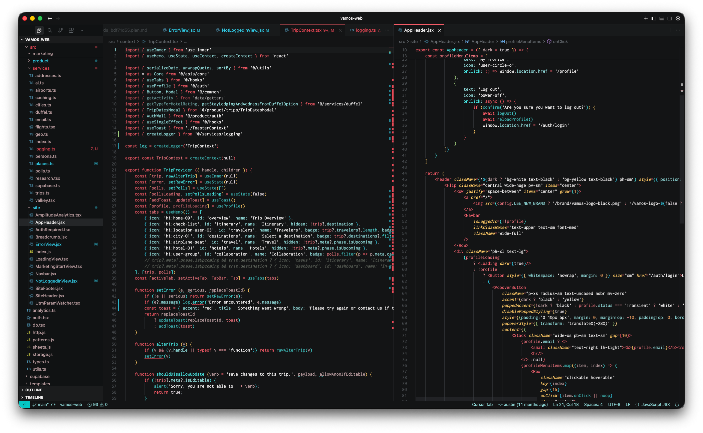

# Killer Dark for VSCode

A dark candy jungle theme for VS Code / Cursor with coral reds, amber golds, and teal accents. Successor to the Killer themes for Atom, Nova, and Firefox.

## Local Installation

1. Copy or clone this folder into your editor's extensions directory
2. Restart the editor
3. Open the Command Palette (`Cmd+Shift+P`) and select **Preferences: Color Theme**
4. Choose **Killer Dark**

## Palette

| Role       | Color                                                            |
| ---------- | ---------------------------------------------------------------- |
| Background | `#131415`                                                        |
| Foreground | `#f6f4f4`                                                        |
| Red        | `#ff5c69`                                                        |
| Gold       | `#ffc966`                                                        |
| Teal       | `#47ebe8`                                                        |
| Green      | `#a8e4a0`                                                        |
| Purple     | `#d6d6ff`                                                        |
